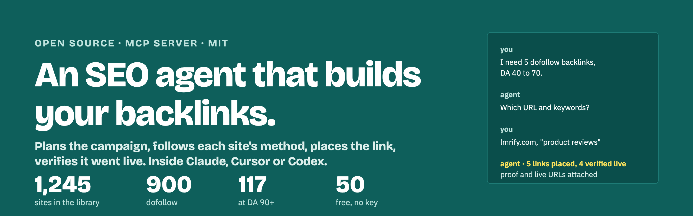
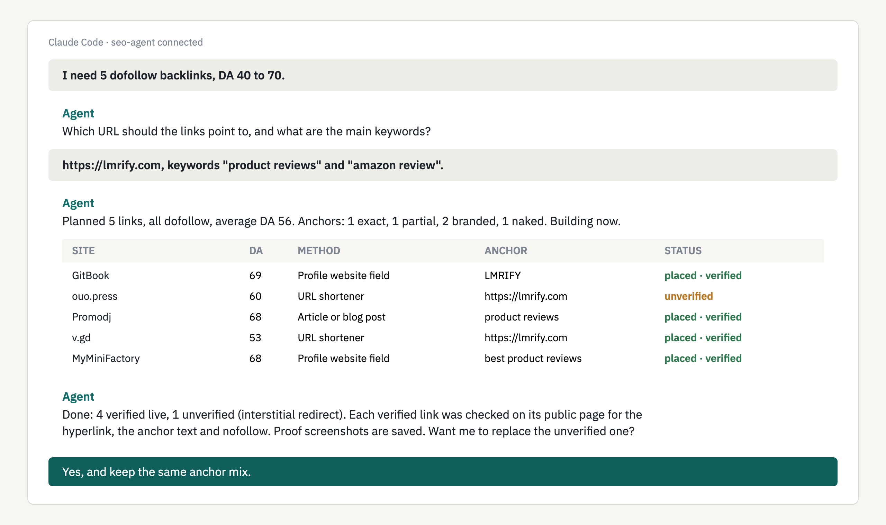
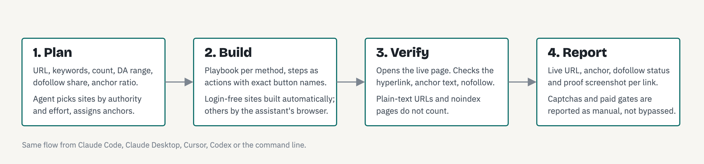

<p align="center"></p>

# Open-source SEO agent for link building

You say what you need. The agent asks for your URL and keywords, plans the campaign, builds each link by following that site's method, checks that it went live, and hands you the live URLs with proof. It works inside Claude, Cursor, Codex or any MCP client.

```bash
pip install seo-agent
claude mcp add seo-agent -- seo-agent
```

## A session, start to finish

<p align="center"></p>

That is the whole interaction. In detail:

1. **You ask in plain language**: *I need 5 dofollow backlinks, DA 40 to 70.*
2. **The agent asks for two things**: the URL the links should point to, and your main keywords. It stores your sign-up identity once so every form is filled the same way.
3. **It plans**: picks sites from the library by authority and effort inside your DA range, keeps the dofollow share you asked for, spreads the methods so it is not five profile pages, and assigns anchor text by ratio: exact, partial, branded, naked, generic.
4. **It builds**: login-free sites are built automatically with a proof screenshot. For sites that need an account, the agent follows the site's method in its browser: the playbook for that kind of link, the steps as actions with the exact button names, and what the site requires.
5. **It verifies**: opens the public page and checks that the target is a real hyperlink, that the anchor matches, and whether the link is nofollow. Plain-text URLs and noindex pages do not count.
6. **It reports**: live URL, anchor, dofollow status and proof per link. Anything that hit a captcha or a paid gate is reported as manual, never bypassed.

*The session above is illustrative. The table below is real.*

## Real links it built

Built for lmrify.com during development, on login-free sites, then verified by fetching each page:

| Site | DA | Live link | Verified |
|---|---|---|---|
| Netcraft site report | 77 | https://sitereport.netcraft.com/?url=https://lmrify.com | hyperlink present, nofollow |
| rentry.co | — | https://rentry.co/tu4euyew | contextual anchor "Let me Review it For You", dofollow attribute, page is noindex |
| write.as | 52 | https://write.as/uooky17nv701i.md | contextual anchor, indexed page, nofollow |
| n9.cl | 40 | https://n9.cl/aav9b | redirects to target |
| goolnk.com | 23 | https://goolnk.com/bwv0gn | redirects to target |
| yellkey.com | 20 | https://www.yellkey.com/forget | redirects to target |

Notice what the verifier caught: one dofollow link sits on a noindex page and one indexed contextual link is nofollow. The agent reports both, because a link you cannot trust is worse than no link.

## How it works

<p align="center"></p>

## What is in the library

| | |
|---|---|
| Sites | 1,245, of which 1,138 verified reachable this month |
| Dofollow | 900 |
| DA 90 or higher | 117 |
| Metrics per site | Domain Authority, referring domains, total backlinks, spam score, organic traffic |
| Methods | profile fields, articles and guest posts, social bookmarking, web 2.0 pages, forums and signatures, directories, shared documents, comments, Q&A, URL shorteners |
| Per site | the step-by-step method parsed into actions, the placement step, and what the site requires: account, inbox, captcha, social login, upload, moderation |

Fifty of these sites, with their methods, are bundled free. The rest, the campaign planner, automatic building and verification come with a free API key when the hosted service opens.

## Install in Claude, Cursor or Codex

Requires Python 3.10 or newer.

**Claude Code**

```bash
pip install seo-agent
claude mcp add seo-agent -- seo-agent
```

**Claude Desktop**: add to `claude_desktop_config.json`:

```json
{ "mcpServers": { "seo-agent": { "command": "seo-agent" } } }
```

**Cursor**: Settings, MCP, add a server with command `seo-agent`.

**Codex CLI**: add an `mcp_servers.seo-agent` entry with `command = "seo-agent"` to `~/.codex/config.toml`.

**With an API key**: set `SEOAGENT_API_KEY=le_...` in the same place. The assistant then sees the full set of tools: `plan_campaign`, `build_link`, `verify_link`, `get_step_screenshot`, `set_identity`, `log_link`, `list_results`, and the `run_campaign` prompt.

## The free backlink sites list

Fifty sites from the library, all verified reachable, DA 37 to 69, 49 of them dofollow. Each has a method your assistant can follow.

<details>
<summary>Show all 50</summary>

| Site | DA | Referring domains | Method | Needs |
|---|---|---|---|---|
| GitBook | 69 | 212,041 | Article or blog post | sign-up |
| MyMiniFactory | 68 | 71,374 | Profile website field | sign-up |
| PromoDJ | 68 | 24,384 | Profile website field | sign-up |
| GrowthHackers | 68 | 7,690 | Forum post | sign-up |
| Gust | 67 | 11,264 | Directory listing | sign-up |
| HUD (.gov) | 66 | 2,569 | Profile website field | email verification |
| Serato | 66 | 7,121 | Profile website field | sign-up |
| Portfoliobox | 66 | 12,479 | Page builder site | no account |
| Credly | 65 | 59,462 | Profile website field | email verification |
| GrabCad | 65 | 17,418 | Profile website field | email verification |
| LeetCode | 65 | 87,346 | Profile website field | email verification |
| Kiwibox | 65 | 9,959 | Article or blog post | sign-up |
| Vingle | 64 | 28,178 | Article or blog post | email verification |
| GameKyo | 64 | 4,959 | Bookmark / link submit | email verification |
| Wantedly | 64 | 29,585 | Bookmark / link submit | sign-up |
| RoundMe | 63 | 8,631 | Profile website field | sign-up |
| ItsMyURLs | 63 | 11,263 | Bookmark / link submit | email verification |
| Zenodo | 62 | 7,015 | Profile website field | email verification |
| LongIsland | 62 | 61,555 | Bookmark / link submit | sign-up |
| Carrd | 61 | 272,016 | Article or blog post | email verification |
| Lacartes | 61 | 7,671 | Bookmark / link submit | email verification |
| Page4 | 61 | 2,162 | Page builder site | sign-up |
| MyVidSter | 60 | 14,641 | Profile website field | sign-up |
| Revue | 60 | 10,106 | Profile website field | sign-up |
| Ouo Press | 60 | 4,724 | URL shortener | no account |
| Hugo | 60 | 3,139 | Forum post | email verification |
| Jssor | 60 | 26,392 | Other | email verification |
| Brownbook | 59 | 50,108 | Profile website field | no account |
| CodeSandbox | 59 | 17,524 | Profile website field | social login |
| Folkd | 59 | 43,937 | Profile website field | sign-up |
| WHMCS | 59 | 3,925 | Bookmark / link submit | email verification |
| Teletype | 59 | 71,176 | Page builder site | no account |
| AllMyFaves | 58 | 50,030 | Bookmark / link submit | sign-up |
| u.to Shortener | 58 | 36,168 | URL shortener | no account |
| BlogFree | 58 | 5,019 | Forum signature | sign-up |
| OnRPG | 58 | 6,380 | Profile website field | sign-up |
| RawPixel | 58 | 28,316 | Profile website field | sign-up |
| Turnkey Linux | 58 | 14,662 | Profile website field | email verification |
| HotFrog | 57 | 23,144 | Bookmark / link submit | email verification |
| Smallseotools Shortener | 57 | 16,522 | URL shortener | no account |
| Tiny.pl Shortener | 56 | 15,801 | URL shortener | no account |
| Start Me | 56 | 39,120 | Page builder site | sign-up |
| Catch Themes | 53 | 46,911 | Forum post | sign-up |
| Givology | 51 | 2,077 | Article or blog post | email verification |
| AbiLogic | 50 | 6,222 | Article or blog post | sign-up |
| Storeboard | 50 | 48,200 | Article or blog post | sign-up |
| Blade Journal | 48 | 4,175 | Article or blog post | sign-up |
| Zyro | 46 | 6,557 | Page builder site | sign-up |
| Yooco | 43 | 8,568 | Comment | sign-up |
| Cgm internet marketing | 37 | 4,120 | Directory listing | email verification |


</details>

More lists, with DA and referring domains: [social bookmarking sites](docs/social-bookmarking-sites.md), [profile creation sites](docs/profile-creation-sites.md), [guest posting sites](docs/guest-posting-sites.md), [web 2.0 sites](docs/web-2-0-sites.md), [directory submission sites](docs/directory-submission-sites.md), [forum posting sites](docs/forum-posting-sites.md), [high DA backlinks](docs/high-da-backlinks.md).

## What it will not do

It does not solve captchas, bypass bot checks, or create accounts where a site forbids automation. When it meets one of those it stops and tells you what was asked. That keeps your site safe and keeps the links you do get worth having.

## Guides

- [How to get backlinks with an AI agent](docs/how-to-get-backlinks-with-ai.md)
- [Claude SEO: link building from Claude Code and Claude Desktop](docs/claude-seo.md)
- [Cursor SEO: link building from Cursor](docs/cursor-seo.md)
- [LLM SEO and SEO automation](docs/llm-seo.md)
- [The SEO MCP server: tool reference](docs/seo-mcp-server.md)

Documentation site: https://m4mansoor.github.io/seo-agent/

## License

MIT. The site library and its metrics are provided as-is; verify a site before relying on it.
