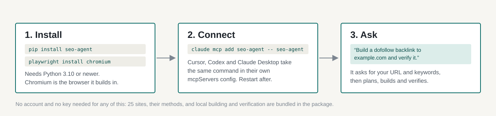
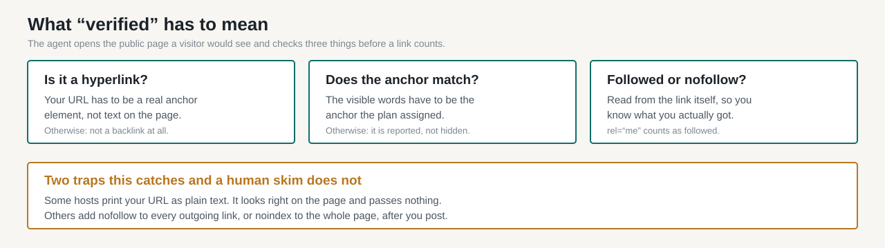
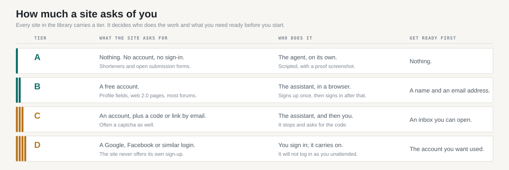

# How to use SEO Agent

This is the long version: every step from an empty terminal to a backlink you can prove is live. Nothing here assumes you have used an MCP server before. If you only want the idea rather than the instructions, read [how an AI agent builds backlinks](how-to-get-backlinks-with-ai.html) instead.

You can do everything in the first six steps without paying anything or creating any account.

---

## Before you start

You need three things.

**Python 3.10 or newer.** Check with `python3 --version`. If it prints 3.9 or lower, install a newer Python before going on — the package will refuse to install otherwise.

**A terminal.** macOS Terminal, any Linux shell, or PowerShell on Windows.

**An MCP client.** That is the assistant the agent plugs into: Claude Code, Cursor, Codex, Claude Desktop, or anything else that speaks MCP. The agent has no interface of its own — it gives your assistant a set of tools, and you talk to your assistant normally.

One more thing worth deciding now: **which site you are building links to, and which two or three keywords matter.** You will be asked for both, and a vague answer produces a vague campaign.

---

## Step 1 — Install



Two commands:

```bash
pip install seo-agent
playwright install chromium
```

The first installs the agent. The second downloads the browser it builds links in — about 150 MB, once. Skip it and every build fails with a missing-browser error.

If `pip` is not found, try `pip3`. If you use pipx, `pipx install seo-agent` works too, but then run `pipx runpip seo-agent install playwright && playwright install chromium`.

**Check it worked:**

```bash
seo-agent --help
```

If that prints usage text, you are set. If it says `command not found`, your Python scripts directory is not on your PATH — see [Troubleshooting](#troubleshooting).

---

## Step 2 — Connect it to your assistant

Pick the one you use.

**Claude Code** — one command:

```bash
claude mcp add seo-agent -- seo-agent
```

**Cursor** — open Settings, MCP, Add new server, and paste:

```json
{ "mcpServers": { "seo-agent": { "command": "seo-agent" } } }
```

**Claude Desktop** — edit the config file directly:

- macOS: `~/Library/Application Support/Claude/claude_desktop_config.json`
- Windows: `%APPDATA%\Claude\claude_desktop_config.json`

Add the same `mcpServers` block as above. If the file already has other servers in it, add `"seo-agent"` alongside them rather than replacing the block.

**Codex, or any other MCP client** — the same `mcpServers` entry, in whatever file that client uses.

**Then restart the client.** MCP servers are read at startup; a running client will not notice a new one.

---

## Step 3 — Confirm the connection

Ask your assistant:

> What SEO Agent tools do you have?

It should list around ten, including `search_sites`, `get_method`, `build_link`, `verify_link` and `list_results`. If it lists none, the client did not load the server — check [Troubleshooting](#troubleshooting).

---

## Step 4 — Set your identity

Most link sites want a name, an email address and sometimes a username. Give these once so every form is filled consistently:

> My name is Alex Reed, email alex@example.com, username alexreed, website example.com.

Two details that matter more than they look:

- **Use an inbox you can actually open.** Some sites email a confirmation link, and an unconfirmed account gets restricted or deleted. A free address is fine as long as you can read it.
- **A consistent identity is a footprint.** The same name and address on forty sites, all linking to one domain, is a pattern. If that concerns you, use a small set of identities rather than one, and vary which sites get which.

Your identity is stored locally on your own machine, alongside your results.

---

## Step 5 — Find sites

Ask in plain language:

> Show me dofollow sites at DA 60 or higher.

You get back name, domain, Domain Authority, referring domains, spam score, dofollow status, the method used to get a link, and the tier. Twenty-five sites are bundled in the package and work immediately; the free plan builds ten links on them, one of which may be on a DA 90+ site. The rest of the library appears by name and DA but locked.

**Read the numbers together, not alone.** Domain Authority is a third-party estimate, not a Google metric. A DA 90 site with almost no referring domains and a high spam score is worth less than a DA 55 site with real traffic. The agent shows you all of these so you can tell the difference.

---

## Step 6 — Build your first link

Start with a site that needs no account:

> Build a dofollow backlink to example.com on a site that needs no account, anchor "compact espresso machines", then verify it.

What happens, in order:

1. It picks a site and tells you which.
2. It opens a browser and follows that site's method — the exact fields and buttons for that site, not a generic script.
3. It places your URL with your anchor text.
4. It takes a screenshot as proof.
5. It opens the resulting public page and verifies the link.
6. It reports the live URL, the anchor, whether the link is followed or nofollow, and where the proof screenshot is saved.

On a no-account site this takes seconds. Your results are logged locally in `~/.seoagent`.

### What "verified" means



A link is only counted when the public page shows a real hyperlink to your URL. Two failures look like success to a human skim and are caught here: a URL printed as plain text, and a host that adds `nofollow` to every outgoing link after you post.

If verification fails, you are told why rather than being given a number that flatters the report.

---

## Step 7 — Sites that need an account

This is where the high authority lives, and where you need to know what each site will ask of you.



**Tier A** needs nothing and is built automatically.

**Tier B** needs a free account. The assistant signs up in its browser using the identity you set, then places the link. The account is remembered, so the next link on that site is a sign-in rather than a sign-up — much faster.

**Tier C** also wants a code or a confirmation link by email, and often a captcha. The agent stops and asks you.

**Tier D** offers no sign-up of its own, only "continue with Google" or similar. You sign in yourself; the agent carries on from there. It will not log into your accounts unattended.

### When it stops and asks: gates

A captcha, an email code, a phone number or a payment request is a **gate**. The agent stops, says exactly what the site wants, and offers you the ways through in the same chat:

- **Clear it yourself** in the browser window it opens, and it continues where it stopped.
- **Connect a service once** so it handles that kind of gate next time — a captcha solver, your inbox over IMAP, or an SMS provider.
- **Paste the code** if the site emailed or texted you one.
- **Skip the site** and move on.

It never pretends to be a person and never works around a site's rules. That is deliberate: links built by breaking a site's terms are the ones that get removed, and the account that built them tends to go with them.

---

## Step 8 — Keep the log, and check again later

Every link is recorded with its live URL, anchor, status and proof. Ask:

> Show me every link you have built.

Links do not last forever: posts get moderated away, profiles get deleted, free hosts close. Re-check them periodically:

> Re-check all my links and tell me which ones are gone.

A link that disappeared is worth knowing about before you count it in a report.

---

## Step 9 — Run a real campaign

One link at a time is fine for learning. A campaign is the point:

> Plan 10 backlinks to example.com, DA 40 or higher, 70% dofollow, keywords "espresso machines, coffee grinders".

The planner picks sites inside your range, spreads the methods so you do not end up with ten identical profile pages, and assigns anchor text by ratio across the five types.

**A sane anchor ratio for a young site:** 10% exact match, 20% partial, 30% branded, 25% naked URL, 15% generic. Forty links all reading "best espresso machine" is the clearest possible signal that links were bought.

**A 100% dofollow profile is not a good profile.** Real sites accumulate nofollow links naturally. 70% is a realistic target.

**Pace matters.** By default a campaign places at most 5 links per day and 20 per week to any one site of yours, spread across methods. That is a feature, not a limit to work around: a hundred links landing in one afternoon is a pattern no natural profile produces.

---

## Going further: the full library

The free twenty-five are real, usable sites, and two of them are DA 90+. The rest of the library — 1,248 sites, the campaign planner, automatic building on account-based sites, gate handling, competitor gap analysis and monthly monitoring — comes with a subscription, currently $97 a year or $27 a month.

After paying, copy the key from the success page and tell your assistant:

> activate le_your_key_here

That verifies the key, saves it on your machine, and the full tool set appears in the same conversation. Fair use is 500 placed links per 30 days.

You can also bring your own AI model key for the browser-driving work, so account-based builds run on your account rather than a shared one.

---

## Troubleshooting

**`seo-agent: command not found`** — the install worked but the scripts directory is not on your PATH. Find it with `python3 -m site --user-base`, then add its `bin` (or `Scripts` on Windows) to your PATH. As a quick test, `python3 -m seoagent.server` should start the server directly.

**The assistant lists no SEO Agent tools** — the client did not load the server. Check the config file is valid JSON, that `seo-agent --help` runs in your terminal, and that you restarted the client. In Claude Code, `claude mcp list` shows what is registered.

**Every build fails with a browser error** — `playwright install chromium` was skipped, or was run for a different Python than the one the package is installed under.

**A site is shown as "locked"** — it is in the full library rather than the free twenty-five. Everything else on the page still works.

**A build stops at a captcha** — that is a gate, not a bug. Pick one of the options it offers.

**A link verifies as nofollow when you expected dofollow** — the host adds it on their side. The site record is a general observation, not a promise about your particular page; the verification tells you what you actually got.

**A build seems stuck** — long builds run in the background so the chat does not time out. Ask for the job status rather than starting again, or you may end up with two accounts on the same site.

---

## What it will not do

Worth knowing before you start, so nothing here is a surprise:

- It will not solve a captcha by pretending to be a person, or evade a site's bot protection.
- It will not post spun or misleading content to get a link past a moderator.
- It will not guarantee a ranking. Links are one input, and no honest tool promises otherwise.
- It will not hide a failure. A link that could not be verified is reported as unverified, not counted.

Links worth having come from sites that meant to publish them. Everything here is built on that assumption.

---

*Questions, or a site behaving differently from its method? [Open an issue](https://github.com/m4mansoor/seo-agent/issues) — site pages change, and a report is how the method gets corrected for everyone.*
